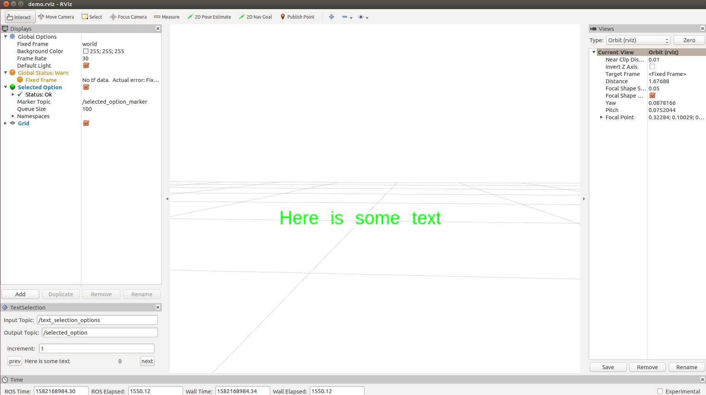

# RViz Text Selection Panel
This panel for RViz is useful when you:
- want to view data in RViz
- Have too much data to view at one time
- Want to manually move forward or backward to view your data

You provide a list of strings. Through this selection tool you manually scroll forward or backward. This panel sends a return message string for the element currently selected. Your code can use this returned string as a key to look up and compute any data and publish any visualization markers relevant to that string.

## Installation
This requires QT5, ROS, and RViz. Clone this repo into your catkin workspace and build. Resource your `catkin/devel/setup.bash` and launch rviz

## Demo
1. Start a `roscore`
1. Launch `rviz` and open the `demo.rviz` file in this repo
2. Run `rosrun rviz_text_selection_panel demo.py`

You should see a marker appear. Using the selection tool, you can scroll through the text options and view them republished as text markers. 

